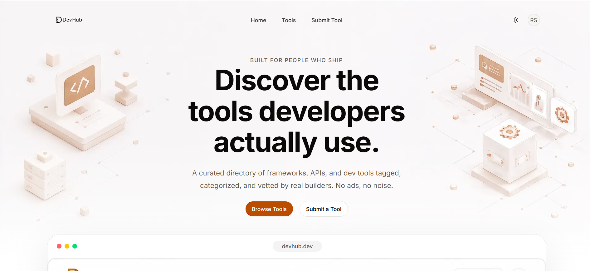

# DevHub

> A curated directory for discovering developer tools — browse, search, and filter frameworks, APIs, and infrastructure, all moderated before they go live.



**Live demo:** https://dev-hub-lake-nine.vercel.app

---

## Description

DevHub solves a simple problem: finding good developer tools usually means digging through scattered blog posts, Twitter threads, and outdated "awesome-lists" on GitHub. DevHub is a single, moderated directory — every tool listed has gone through an approval step, whether it was seeded, added by an admin, or submitted by the community.

It's aimed at developers looking to discover new tools by category (AI/LLM, databases, DevOps, testing, etc.) and at contributors who want to submit tools they use and trust. It also doubles as a reference implementation of the Next.js App Router done deliberately — Server Components for data fetching, Server Actions for mutations, and URL-driven state for search/filter/pagination, rather than the more common client-heavy approach.

## Tech Stack

- **Framework:** [Next.js 16](https://nextjs.org) (App Router, Turbopack)
- **Language:** TypeScript
- **Runtime / package manager:** [Bun](https://bun.sh)
- **Database:** PostgreSQL, hosted on [Neon](https://neon.tech)
- **ORM:** [Prisma](https://prisma.io)
- **Auth:** [Better Auth](https://better-auth.com) — email/password and Google OAuth
- **UI:** [shadcn/ui](https://ui.shadcn.com) (Radix primitives) + Tailwind CSS
- **Client-side data fetching:** [TanStack Query](https://tanstack.com/query)
- **Validation:** [Zod](https://zod.dev)
- **Deployment:** [Vercel](https://vercel.com)

## Installation

**Prerequisites:** [Bun](https://bun.sh) installed, and a Postgres connection string (a free [Neon](https://neon.tech) project works).

1. Clone the repository:
   ```bash
   git clone https://github.com/<your-username>/devhub.git
   cd devhub
   ```

2. Install dependencies:
   ```bash
   bun install
   ```

3. Create a `.env` file in the project root:
   ```env
   DATABASE_URL="postgresql://..."
   BETTER_AUTH_SECRET="generate-a-random-secret-string"
   NEXT_PUBLIC_APP_URL="http://localhost:3000"
   GOOGLE_CLIENT_ID="..."
   GOOGLE_CLIENT_SECRET="..."
   ```

4. Run database migrations:
   ```bash
   bunx prisma migrate dev
   ```

5. Seed the database with categories and sample tools:
   ```bash
   bunx prisma db seed
   ```

## Usage

Start the development server:

```bash
bun dev
```

The app runs at [http://localhost:3000](http://localhost:3000).

Other useful commands:

```bash
bunx prisma studio       # open a GUI to inspect/edit database rows
bunx prisma migrate dev  # apply new schema changes
bun run build            # production build
bun run start             # run the production build locally
```

**Example: browsing tools by category and tag**

```
/tools?page=2&category=databases-storage&tag=open-source
```

All search, filter, and pagination state lives in the URL — no client-side state library involved, so any of these links can be shared or bookmarked directly.

## Contributing

Contributions are welcome, particularly bug reports and tool suggestions.

1. Fork the repository and create a branch from `main`:
   ```bash
   git checkout -b fix/short-description
   ```
2. Make your changes. Keep commits focused — one logical change per commit.
3. Run the app locally and confirm nothing's broken before opening a PR.
4. Open a pull request describing what changed and why. Link any related issue.

For bug reports, please include: steps to reproduce, expected vs. actual behavior, and your environment (OS, Bun version). Open these as a GitHub Issue.

## License

Licensed under the [MIT License](./LICENSE).